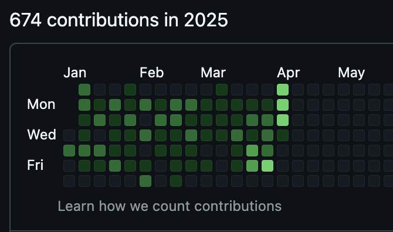
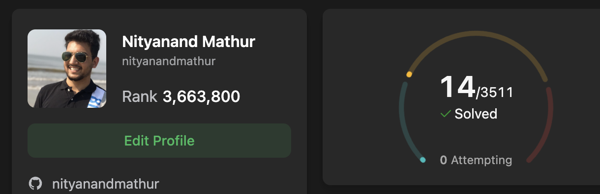
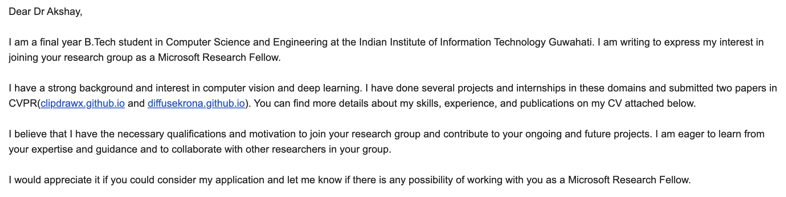
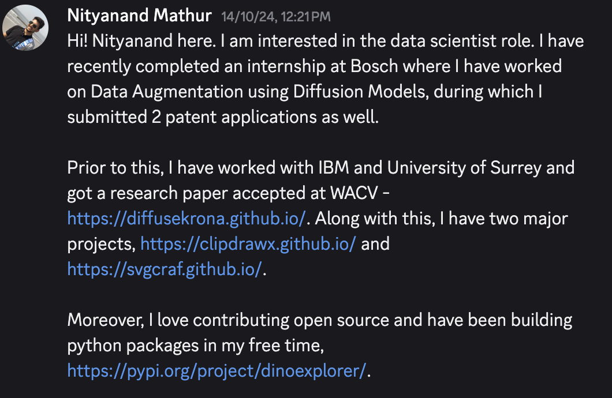

<!--
theme: gaia
class:
 - invert
headingDivider: 2 
paginate: true
-->

<!--
_class:
 - lead
 - invert
-->

# IIITG Alumni Talk 2025

What I Wish I Knew About Engineering

## About me
* Data scientist @ Smallest AI
* Interns
    - Bosch Research - Data Augmentation using Diffusion
    - IBM - Parameter Efficient Training of Diffusion
    - University Of Surrey - Explainable Sketch Generation
    - Osaka University - Counterfactual Machine Learning
    - CogXR Labs - MLOps and Image Classification
    - IIITG - Service Caching Algorithms - Dr. Radhika Sukarpuram
    - IIITG - Hate Meme Detection - Dr. Ferdous Ahmed Barbhuiya

## How to bring new ideas?   How to make subjects more interesting?

Ideas are floating everywhere, you just need to look around.

1. Spotify latency reduction
2. Sniper AI from IGI

Relate subjects/topics with your favourite hobbies.
1. Interstellar and ODEs
2. Curl of VFs and weather prediction

## Common Myths

If someone gets an idea, or a startup shoots, is he/she lucky?

**NO**

What if you fail?

**If not now, then when?
If not you, then who?**

## But, what if I couldn't think of novel ideas?

- Pickup a good feature and make it real-time.
- Create SDKs
- Create PyPi / NPM packages

## But how does it helps?

> If no one knows your work exists, it doesn’t matter how good it is.
- Green is the new sexy! 

## Does DSA matter?
- If you want a 9 to 5 job, yes!

- If you want to make impact / do research / create startups, no!

## How to approach for Internsips/FTs?
Apart from applying on portal  
**Cold Mailing / LinkedIn**   

#

## Job Offer

Build an TTS analysis tool(metric based), which determines:
1. How good is the quality of audio?
2. Does the TTS speak what it is supposed to?
3. To what extent does it replicate the speaker?

Give me numbers and I guarentee **Minimum CTC - 35 LPA!**

## Ending notes

1. Get obsessed with what you do. 

2. Obsession >>>> Discipline.

3. Never get scared!

4. Build in public as much as you can.

5. Confidence is all you need!

# 🎉
<!--
_class:
 - lead
 - invert
-->
### Hooray!

